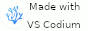

+++
title = "About"
+++

I am Andrea (he/him), an archaeologist with a lot (maybe too many) interests. 

Go to &rarr; [quick facts](#quick-facts) ~ [about me](#about-me) ~ [about work](#about-the-work) ~ [about the site](#about-this-site) ~ [small web](#small-web)

{{ image(src="about.webp" alt="A half-body picture of Andrea Titolo on a bridge. Colored houses in the background", class = "img-avatar", width_override = 200) }}

## Quick facts

- Born and grew up in Rome, Italy.
- Currently living in a rented apartment in Turin, Italy.
- Got my PhD in Western Asia Archaeology in 2020 (yay!)
- Speaks Italian and English, the latter fluently, but I guess in a weirdly academic way.
- I am absolutely terrible at any form of creative work and I admire any creative person as a wizard of our times.
- I tend to become obsessed with one thing that catch my interest, learn everything about it and then leave it forever without having done much with it.

## About me

I have lots of interests, although none of them are exactly hobbies. I like computers, I enjoy using them and learn tech stuff about them. Tech in general, and learning new things is something that really stick with me every day. I like to learn, explore and reading about stuff I don't know, and then try and experiment with it. I also like to share what I know, which is why I enjoy teaching, however in a more informal way (I find being behind a desk and just talk really boring).

I am a great fan of video games, especially those with a historical focus. In general, I play mostly strategy game, either RTS, 4X or Grand Strategy. Some of my favorites are the Civilization Series, Age of Empires Series, Total War series and almost everything developed by Paradox and Creative Assembly (Crusader Kings II/III being my absolute favorites together with most of the Warhammer/Rome Total War). Soulslike is also another genre I enjoy the most (e.g the Dark Souls series), as I love the world-building, level design, challenging gameplay and (not always) good rewards gameplay-wise. Last but not least are RPG Games, like the best game in the world, Skyrim. Recently, I have started to enjoying more relaxed and chill games, like Stardew Valley.

I like reading. I cannot focus on one book at the time recently, unless that book really catches my undivided attention. Genres I like the most are fantasy and sci-fi, and I used to enjoy historical novels, but it's been a while since I engaged with them. Recently I am reading a lot of non-fiction books and papers (at least I'm starting them).

Other things I like are tv-shows and movies, Star Wars and Lord of the Rings universes, Star Trek (kind of all the nerdy stuff), historical fictions, and I enjoy watching anime as well.

## About the work

I currently work at the [University of Turin](https://www.unito.it) as a researcher (actually post-doctoral research associate, but I'll spare you all the weird namings we have for people working in academia). Here I do computer-based work inside a larger project. My job is to take ancient-settlement data (location and size, mostly), and do spatial and quantitative/statistical analyses on them. In the past (and currently as well) I also did remote-sensing work, which means gathering and analyzing satellite images to inspect the archaeological landscape. In particular, I worked a lot with declassified satellite images. I am a landscape archaeologist, which means my interest go beyond a single archaeological site, to inspect larger areas and regions with their elements (the "archaeological landscape"). For more details, there is my [academic website](https://andreatitolo.com).

## About this site

This site is built using [Zola](https://getzola.org/) and is hosted on [Netlify](https://www.netlify.com/). I am still very new to web development and I definitely can't call myself a programmer/developer, so while I try to keep things as minimal as possible, there will be some improvements needed regarding optimisation and stuff. For this reason, this site is highly susceptible to change as I learn new stuff and implement (and likely break) new things. Or, on the other hand, I might lose interest and just keep it this way...no idea, but that's the fun part. More information on the site available in the [colophon](/metrics).

## RSS

You can follow the blog using your preferred rss feed reader by copying any of the link available at the [rss page](/rss).

## Socials

As many people of my age, I tried most social networks. It was a good ride at the beginning, but a degrading experience over time drew me away from mainstream social media. I quit twitter in February 2023 and I am now only active on Mastodon, specifically on the <a rel="me" href="https://archaeo.social/@andreatitolo">archaeo.social instance</a>. Other ways for contacts are available in the [contact page](/contact).

## More about me

- [Now](/now): what I am focusing on at this point in my life.
- [Uses](/uses): hardware and software I use every day.
- [Blogroll](/links): blogs I like to read and websites I generally like.

## More about this blog

- [Credits](/credits): inspirations and resources used for the site.
- [Colophon](/metrics/): stats and details about the site.
- [Privacy and Copyright](/privacy/): privacy notice and copyright.

# Small Web

## Buttons

I recently rediscovered this beauty, they are amazing!

Here are my buttons, feel free to add it to your site, and if you do send me an [email](mailto:298mtxjd@anonaddy.me) or ping me [somewhere else](/contact).

 

```html
<a href="https://www.archaeoramblings.com" target="_blank"></a>
```

> Please, avoid hot-linking; instead place a copy on your own site.

If you have a button, let me know! I will happily add it below.

<section id="buttons-container">

### People

[](https://starbreaker.org)
[](https://daudix.codeberg.page)
[](https://astral.town/)
[](https://getimiskon.xyz)

### Others

[](https://hillhouse.neocities.org/journal/notes/palestine)
[](https://kiwix.org/en/)
[](https://archive.org/)
[](https://archive.org/)
[](https://www.torproject.org/)
[](https://www.mozilla.org/en-US/firefox/new/)

[](https://yesterweb.org/no-to-web3/)
[](https://www.eff.org/)
[](https://wiby.me/)
[](https://fediverse.party/en/fediverse)


[](https://anybrowser.org/campaign/index.html)

[](https://vscodium.com/)
[](http://jigsaw.w3.org/css-validator/validator?lang=en&profile=css3svg&uri=https%3A%2F%2Fwww.archaeoramblings.com&usermedium=all&vextwarning=&warning=1)
[](https://validator.w3.org/nu/?doc=https://www.archaeoramblings.com/)
[](https://validator.w3.org/feed/check.cgi?url=https%3A%2F%2Fwww.archaeoramblings.com)
[](/rss)
[](mailto:298mtxjd@anonaddy.me)
[](https://fediring.net/)
[](https://webring.archaeo.social/)
[](https://itawebring.altervista.org/)
[](https://512kb.club/)
[](https://250kb.club/www-archaeoramblings-com/)

</section>

[Back to top](#quick-facts)